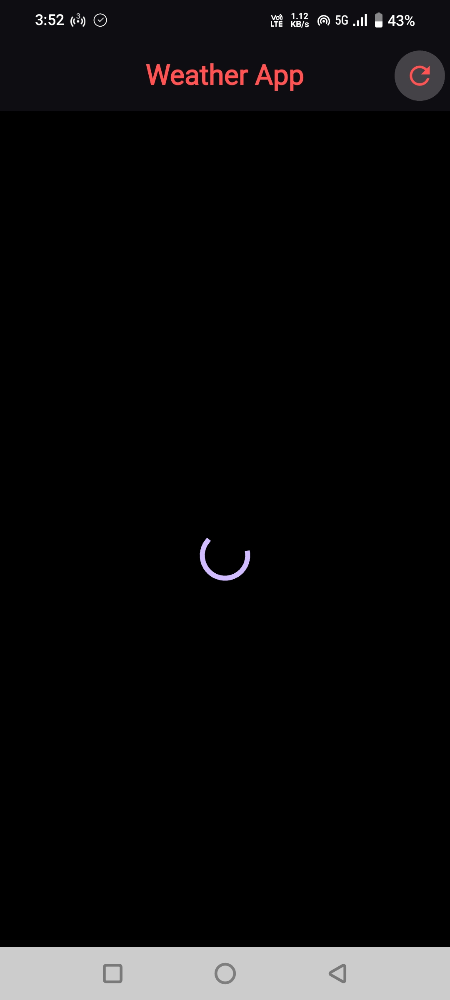
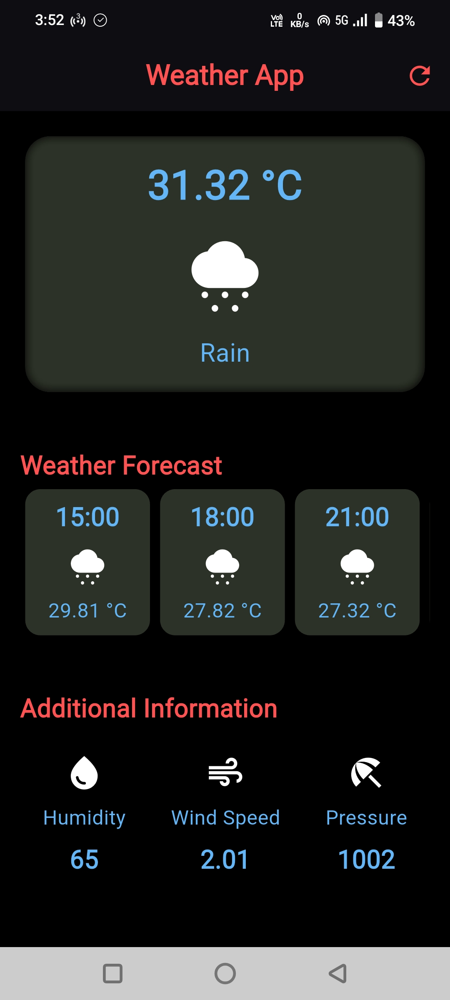

# Weather App 🌤️

A simple weather app built using **Flutter**, **Dart**, and the **OpenWeatherMap API**. This project is ideal for beginners learning Flutter and working with APIs.

## Features

* Real-time weather data fetching using OpenWeatherMap API
* Refresh button to update current weather
* Displays temperature, weather condition, and city name
* Simple and clean user interface
* Lightweight and easy to run

## Screenshots
<table border=0px>
  <tr>
    <td></td>
    <td width="50">&nbsp;</td>
    <td></td>
  </tr>
</table>


## How to Download and Use

### 1. Clone the Repository

```bash
git clone https://github.com/Dhineshkumarprakasam/weather_app.git
cd weather_app
```

### 2. Install Dependencies

Make sure you have Flutter installed and then run:

```bash
flutter pub get
```

### 3. Add Your OpenWeatherMap API Key

* Go to [OpenWeatherMap](https://openweathermap.org/api) and sign up for an API key.
* Open your Dart where the API key is used `secret.dart` and replace the placeholder with your actual API key:

```dart
const String apiKey = 'YOUR_API_KEY_HERE';
```

> Optionally, use packages like `flutter_dotenv` to store your key securely.

### 4. Run the App

Ensure your emulator or physical device is running, then execute:

```bash
flutter run
```

---

## 📚 Resources

* [Flutter Docs](https://docs.flutter.dev/)
* [OpenWeatherMap API](https://openweathermap.org/api)
* [Flutter Cookbook](https://docs.flutter.dev/cookbook)
